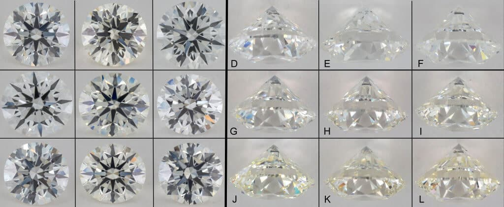

# Predicting the sale price of a Diamond

A weekend project by Roberto Henríquez Perozo

Data Analytics Bootcamp - March 2020

# Can a machine learning algorithm guess the price of a diamond based on its features?

This week, we have participated in a private Kaggle Competition, which consisted in estimating the price of a diamond, based on a dataset of diamonds labeled with their `price` following **features**:

- `id`: only for test & sample submission files, id for prediction sample identification
- `price`: price in USD
- `carat`: weight of the diamond
- `cut`: quality of the cut (Fair, Good, Very Good, Premium, Ideal)
- `color`: diamond colour, from J (worst) to D (best)
- `clarity`: a measurement of how clear the diamond is (I1 (worst), SI2, SI1, VS2, VS1, VVS2, VVS1, IF (best))
- `x`: length in mm
- `y`: width in mm
- `z`: depth in mm
- `depth`: total depth percentage = z / mean(x, y) = 2 * z / (x + y) (43--79)
- `table`: width of top of diamond relative to widest point (43--95)

To predict the price, we began with a minimal research of the topic, and the good ol' fashioned `linear regression` model to find the correct sale price. 

## Optimizing our prediction with `Root Mean Squared Error (RMSE)`
-------------------------
#### Benchmark:
For the first attempt, we dropped all the non-numeric features from the dataset (`color`, `clarity`, etc.); and without cleaning the data, we proceeded to submit a prediction to Kaggle which measured an aprroximate `RMSE` value of `1539`.

Our goal was to lower that score as much as possible.

Following that benchmark, we changeds the regression estimator to a `HistGradientBoostingRegressor` with default parameters, and we immediately saw an improvement in our `RMSE` score, measuring an approximate value of `1324`. After some experimentation with the `GridSearchCV` function of `sklearn`, we sent a third prediction using the same numerical dataframe we used for our previous predictions, but our resulting score did not change.

In order to improve, we decided to change strategies, return to analyzing our data.

#### Improving Pre-processing:
We started cleaning our data further, by transforming the `clarity` into a linear scale from `0` to `N`, where `N` is the number of unique values for that feature, sorted from a pure diamond with a vaue of 0, to the haziest, impurest diamond `clarity` with a value of `N`. We did the same with the `color` and `cut` features.

Using this newly categorized data, whcih we called `numfeats_qd`, and after refactoring our code, we were able to achieve an `RMSE` value of `603` with a `Linear Regression`, and of `564` with a parametrized `GradientBoostingRegressor()`

After this significant increase, we interviewed a jewelery seller, to understand even more about diamonds and their market.

As a result of this conversation, we changed the scales of the `clarity`, which consisted of equidistant points, and assigning similar values to categories which were similar, like `VVSI1` and `VVSI2`.

Aditionally, to enriched our data with an additional `depth_category` column, we copied and transformed the `depth` values into an arbitrary one when they were found between a range that we wanted to specify. --- This was done because  of the information discussed with the jewelery seller **the depth ratio is one of the main features responsible of the refraction of light on a diamond.** If the depth ratio is between the values of `55 to 65` percent, then the light is better refracted when the diamond is seen from above.

These scales of subjective value in the way a diamond refracts light was achieved using the following function of the `src.datahandler.py` module.

## Working with machine learning models (estimators):
With this new metodology for data preprocessing, we achieved a `RMSE` of around `540`. This was a value we felt confident with, and with a score similar to other Kaggle competitors, so finally we took the remaining time of the competitio to refactor our code, prepare this presentation and use all the possible regression estimators from `sklearn` to find out the most appropriate use for our case study: 

-----
## Check out my github profile for more cool data projects: [@rihp](www.github.com/rihp)